# Website-Forum

# website-forum

- Người thực hiện:
Nguyễn Thế Quang (Mã sinh viên: 22T1020362, ĐHKH Huế)

# Mục lục

- [Website-Forum](#website-forum)
- [website-forum](#website-forum-1)
- [Mục lục](#mục-lục)
- [Tính năng](#tính-năng)
- [Ảnh chụp giao diện người dùng](#ảnh-chụp-giao-diện-người-dùng)
  - [Trên Desktop](#trên-desktop)
- [Cách cài đặt (Windows 11)](#cách-cài-đặt-windows-11)
- [Bảng theo dõi tiến độ](#bảng-theo-dõi-tiến-độ)
- [Dự định tương lai](#dự-định-tương-lai)

# Tính năng

- Website Forum với các tính năng:
+ Phát triển một Website hỗ trợ quản lý, lưu trữ và hiển thị thông tin về các bài viết và bình luận trên bài viết.
+ Đăng nhập, đăng xuất.
+ Thêm, sửa, xóa, xem, tìm kiếm tài khoản cho Admin.
+ Hiển thị thông tin người dùng và đổi mật khẩu.
+ Hiển thị thông tin về bài viết, bình luận theo 2 hướng: Hướng 1 là cho Admin để quản lý bài viết và bình luận; Hướng 2 là cho cả Admin và User là quản lý bài viết và bình luận của riêng tài khoản.
+ Thêm, sửa, xóa, xem, tìm kiếm bài viết và bình luận của tất cả tài khoản (Đối với Admin).
+ Thêm, sửa, xóa, xem, tìm kiếm bài viết và bình luận của riêng tài khoản đăng nhập (Đối với Admin và User).
+ Tìm kiếm AI bằng Gemini cho bài viết, bình luận (Đối với Admin) và cho bài viết và bình luận của riêng tài khoản đăng nhập (Đối với Admin và User).
+ Trình soạn thảo đối với nội dung trong tạo mới, sửa bài viết, bình luận (Đối với Admin) và bài viết và bình luận của riêng tài khoản đăng nhập (Đối với Admin và User).
+ Nhắn tin Chatbot AI (Đối với Admin và User).

# Ảnh chụp giao diện người dùng
## Trên Desktop

| Đăng nhập                         || Đăng ký                         	     |
| ----------------------------------|-| -------------------------------------|
| 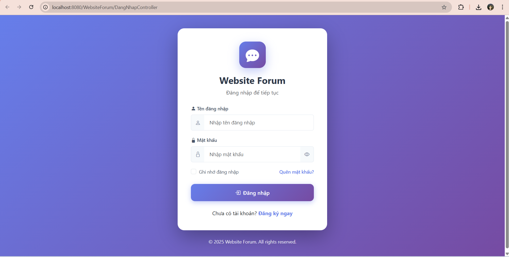   || 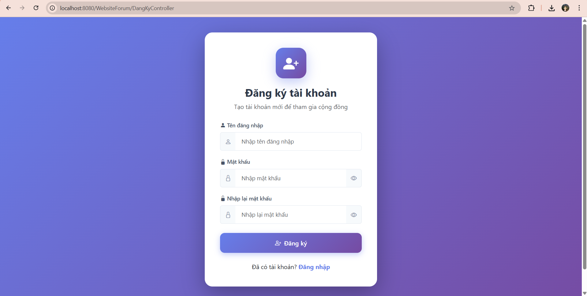 | 

| Quên mật khẩu                       	    || Trang chủ                     |
| ------------------------------------------|-| -----------------------------|
| 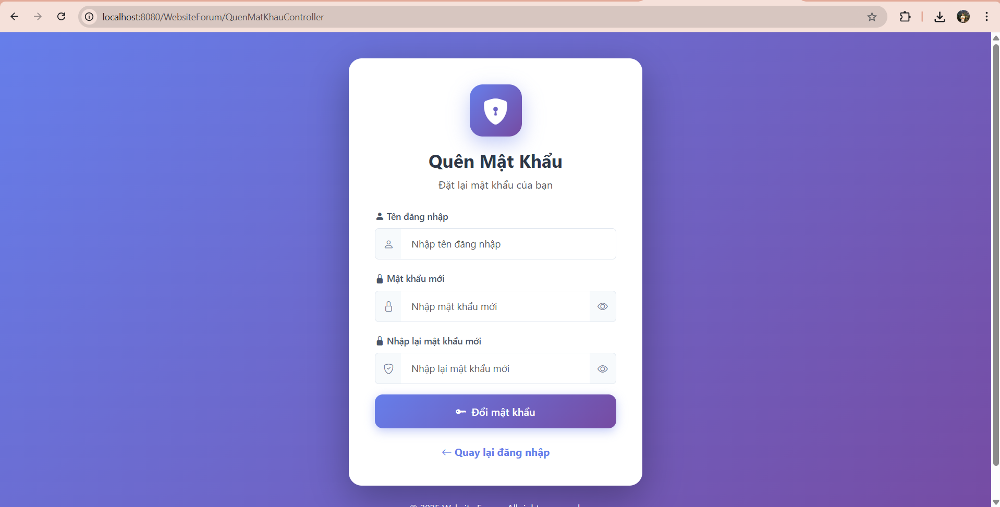 || 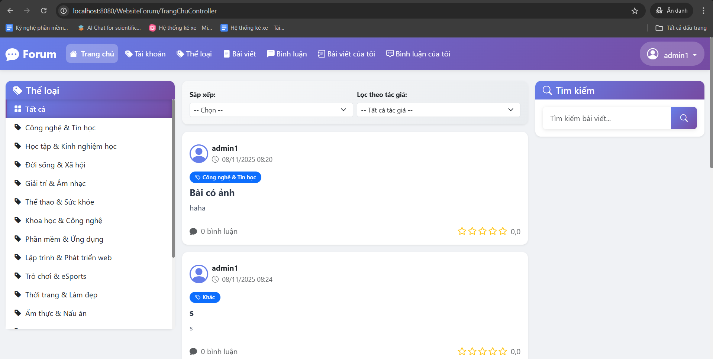 |

| Admin - Tài khoản                           |
| --------------------------------------------|
| 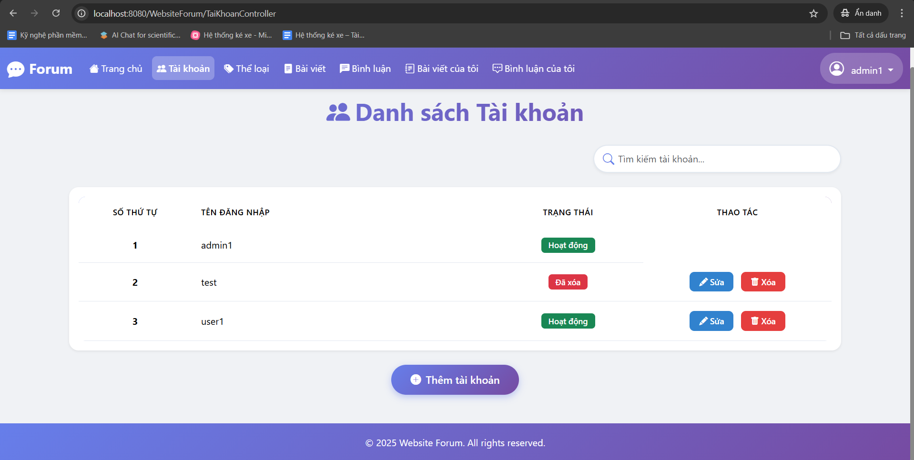 	      |

| Admin - Thể loại (1)                                || Admin - Thể loại (2)                                |
| ----------------------------------------------------|-| ---------------------------------------------------|
| 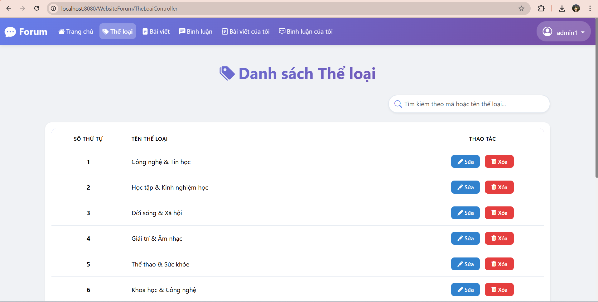 || 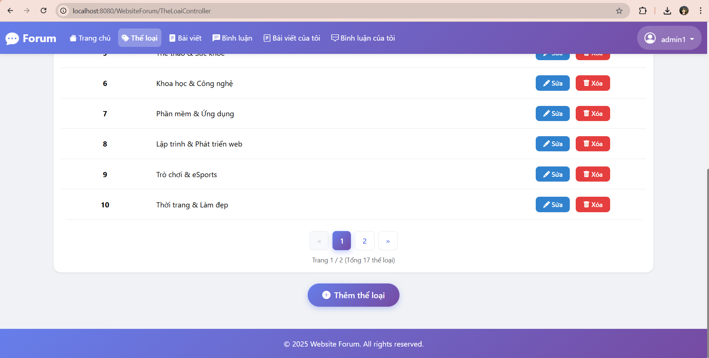 |

| Admin - Bài viết (1)                         || Admin - Bài viết (2)                            |
| ---------------------------------------------|-| -----------------------------------------------|
| 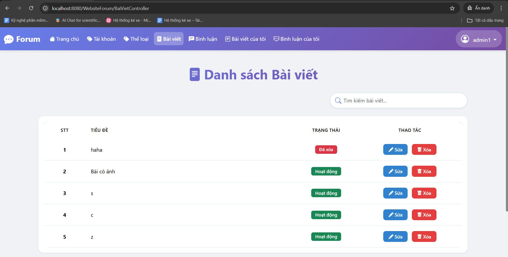  || 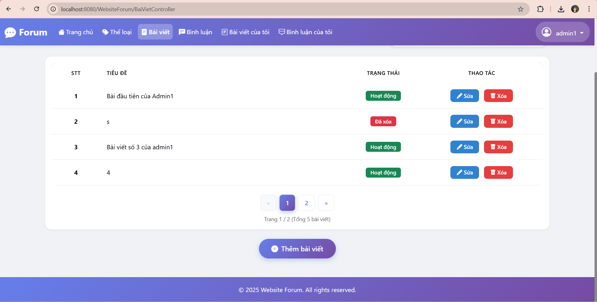 |

| Admin - Bình luận                               || User - Bài viết của tôi (1)                   |
| ------------------------------------------------|-| ---------------------------------------------|
| 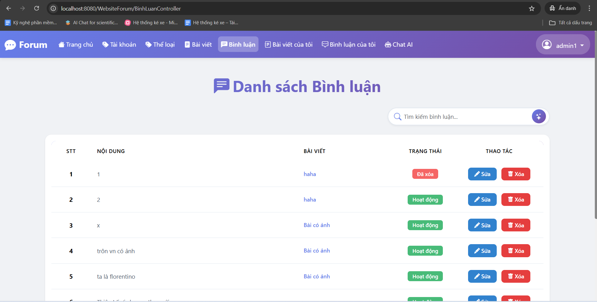 || 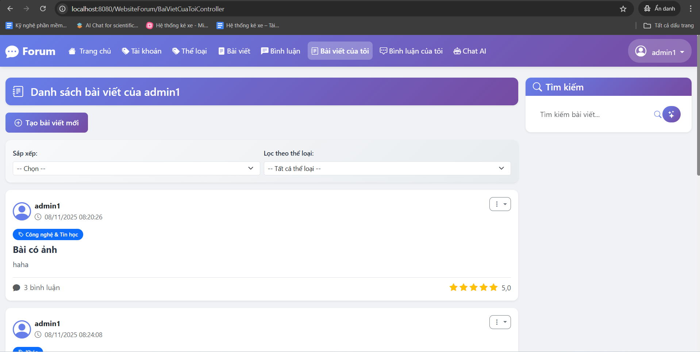 |

| User - Bài viết của tôi (2)                    || User - Bình luận của tôi (1)                        |
| -----------------------------------------------|-| ---------------------------------------------------|
| 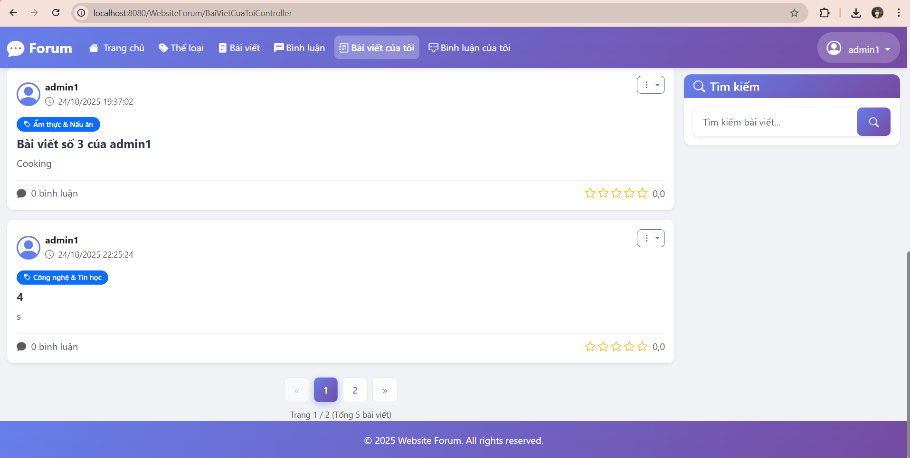  || 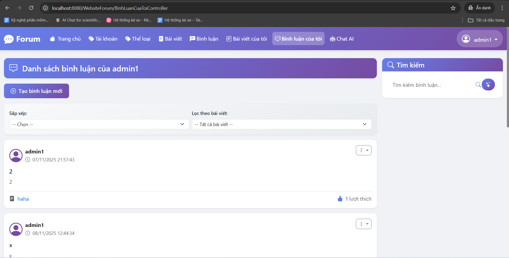 |

| User - Bình luận của tôi (2)                         || Thông tin cá nhân             |
| -----------------------------------------------------|-| -----------------------------|
| 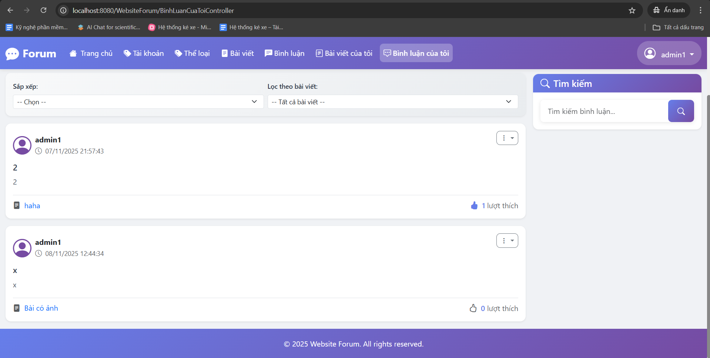  || 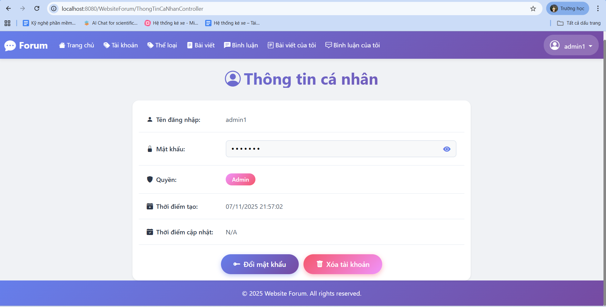 |

| Đổi mật khẩu                               || Chatbot                          |
| -------------------------------------------|-|---------------------------------|
| 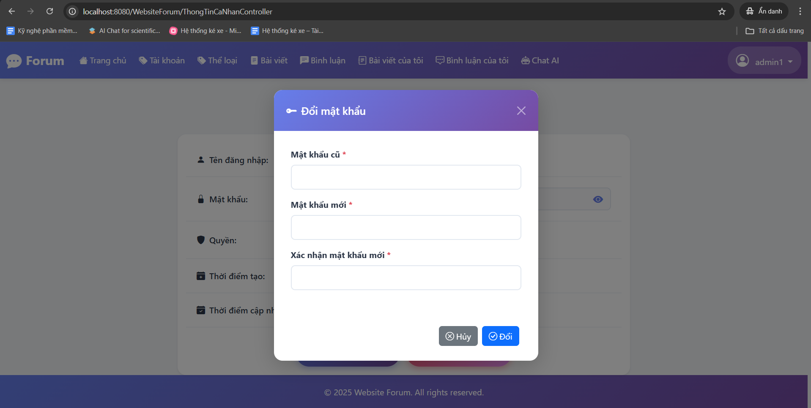  || 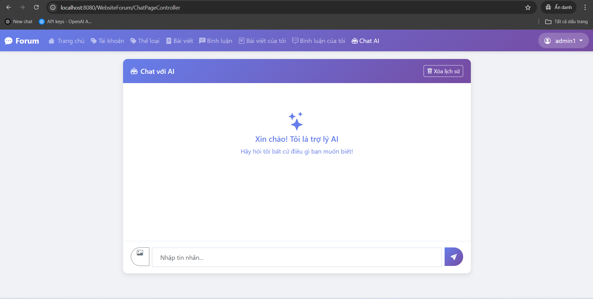 |

# Cách cài đặt (Windows 11)

- Cài: Java JDK 23, Eclipse IDE 2024-12, Tomcat v9.0 Server, Ecipse Enterprise Java and Web Developer Tools 3.36 (Trong Eclipse Marketplace), SQL Server 2014.
- Bước 1: Tải file zip trên link github về.
- Bước 2: Tạo Dynamic Web Project tên: WebsiteForum trong Eclipse IDE, giải nén file zip vào trong thư mục project WebsiteForum vừa tạo.
- Bước 3: Mở SQL Server 2014, chạy database/sqlserver/script.sql trong SQL Server 2014,sau đó chèn thêm dữ liệu vào trong. Bắt buộc phải có dữ liệu trong bảng ApiKey nếu muốn dùng tìm kiếm AI và Chatbot AI, dòng dữ liệu đầu là APIKey của Gemini, dòng thứ hai là ApiKey của OpenAI.  
- Bước 4: Mở project WebsiteForum vừa giải nén file zip ở trong, trong Ecipse IDE.
- Bước 5: Mở Java Resources - src/main/java - Controller.DangNhap - DangNhapController.java.
- Bước 6: Nhấn chạy (Nút Play màu xanh lá cây) trong Ecipse IDE - Chọn Tomcat 9 - Finish. 
- Bước 7: Ecipse IDE tự động hiển thị Website trên URL: http://localhost:8080/WebsiteForum/DangNhapController của trình duyệt Web mặc định.

# Bảng theo dõi tiến độ

| Ngày | Công việc  | Ghi chú |
| ---- | ---------- | ------- |
| 07 - 13/11/2025 | Lên ý tưởng Website, mô tả bài toán và khởi tạo dự án | GG Docs, Github |
| 14 - 27/11/2025 | Phân tích thiết kế hệ thống, thiết kế giao diện | StarUML, Balsamiq |
| 28/11 - 18/12/2025 | Thiết kế CSDL, lập trình Backend và Frontend | SQL Server 2014, Java Servlet, JSP, Tomcat Server, HTML CSS Javacscript |
| 19-25/12/2025 | Hoàn thiện Website, viết báo cáo | GG Docs |

# Dự định tương lai

- [ ] Cập nhật cấu trúc Website, làm tối ưu và làm sạch code.
- [ ] Tối ưu cấu trúc cơ sở dữ liệu của Website.
- [ ] UI : Thiết kế giao diện đẹp hơn.